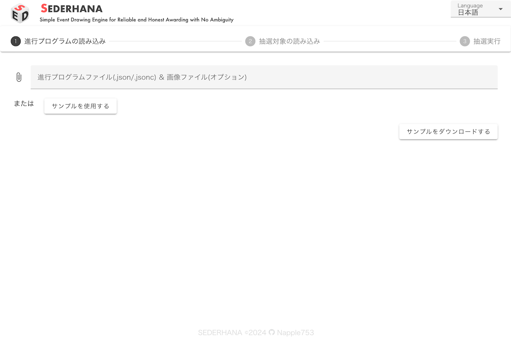
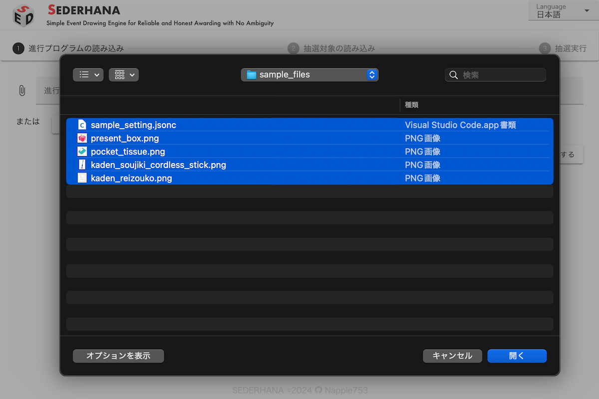
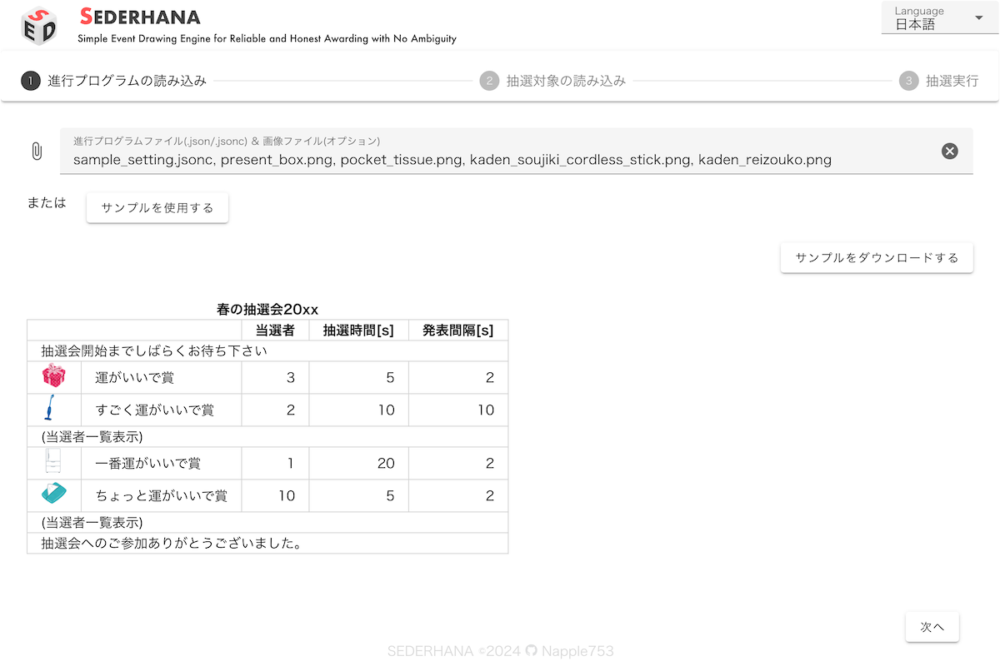
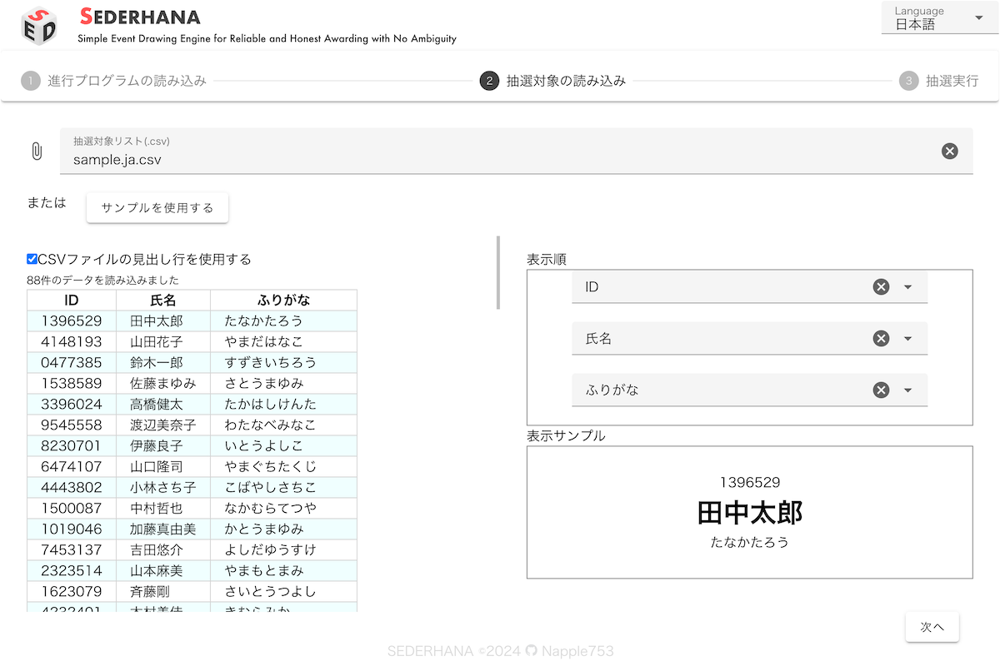
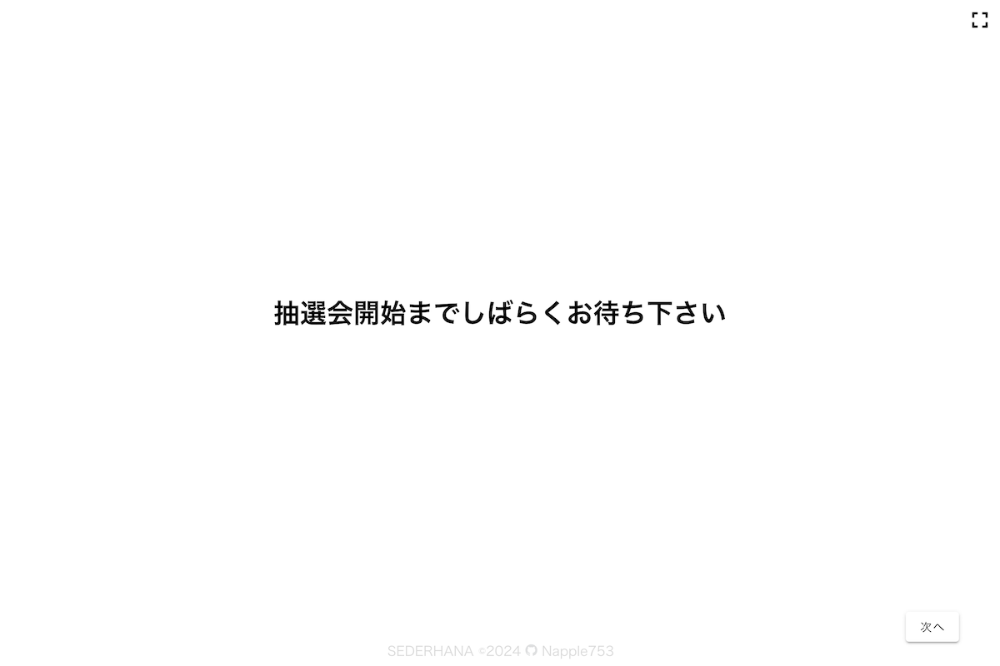
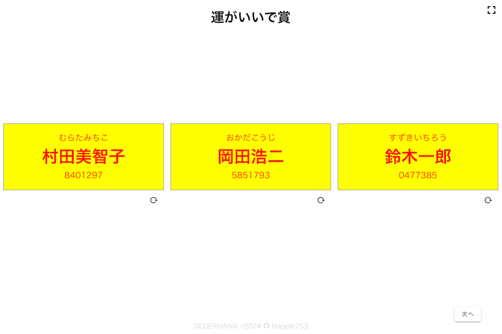
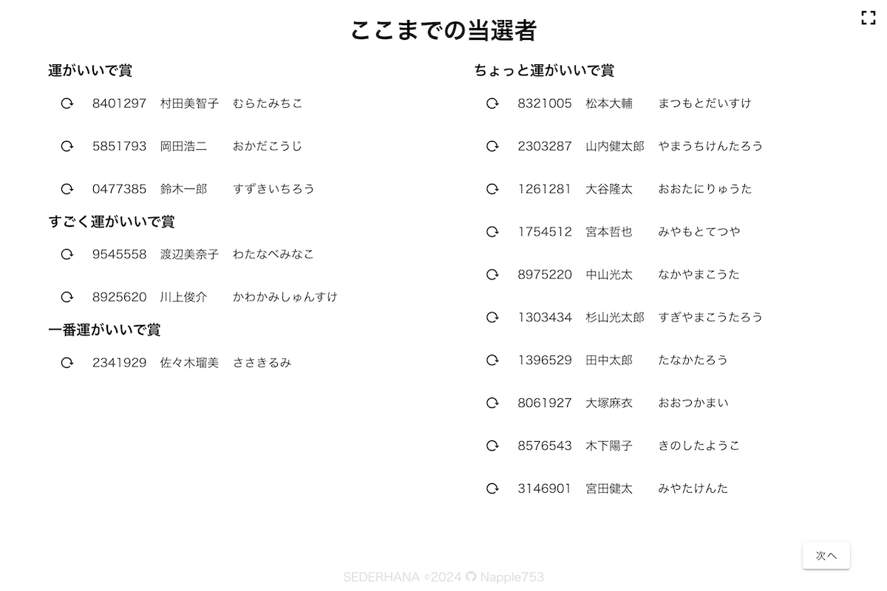
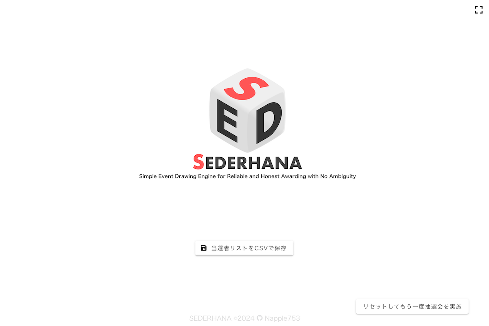

[English](README.md) | [Japanese](README.ja.md)

# SEDERHANA

CSVの抽選対象リストとJSONCの進行プログラムを元に抽選を行うウェブツールです。

## 使い方

### 事前準備

抽選をするために進行プログラム(抽選する賞の名前、当選人数など)と抽選対象リスト(名簿など)が必要です。

進行プログラムはJSONC(JSON with Comments)で記述します。  
[サンプルファイル](/public/sample_setting.ja.jsonc)を参考に進行プログラムを準備してください。

抽選対象リストはCSVで準備します。

### 進行プログラムの読み込み

1. 下記URLからSEDERHANAを開きます。
   https://napple753.github.io/simple-lottery/
   
2. ファイルを選択します
   このとき、画像ファイルも **同時に** 選択します。
   
3. 進行プログラムと画像が表示されるので内容を確認します。
   
4. 「次へ」で抽選対象リストの読み込みに進みます

### 抽選対象リストの読み込み

1.  抽選対象リストも読み込みます
    
2.  「次へ」でプログラムの読み込みが始まります。

### 進行開始

1.  プログラムの最初の画面が表示されます。右上のボタンから全画面表示にすることができます。
    
2.  「次へ」で次のプログラムに切り替わります。
3.  抽選プログラムはまず賞の名前と（設定していれば）画像が表示されます。「抽選スタート」で抽選が始まります。
    
4.  抽選が行われ結果が表示されます。
    
5.  「次へ」で次のプログラムに切り替わります。
6.  「DISPLAY_WINNERS」を進行プログラムに入れることで、当選者の表示をすることができます。
    

### 当選者リストの保存

1.  すべての進行プログラムが終了すると下のような画面になります。ここから当選者をCSV形式で保存することもできます。
    
