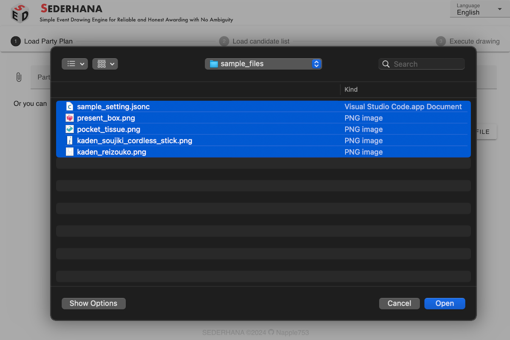

[English](README.md) | [Japanese](README.ja.md)

# SEDERHANA

A web tool for conducting lotteries based on a CSV candidate list and a JSONC Party Plan programs.

## How to Use

### Preparation

To conduct a lottery, you need a Party Plan (with prize names, number of winners, etc.) and a candidate list.

The Party Plan programs should be written in JSONC (JSON with Comments).  
Please refer to the [sample file](/public/sample_setting.jsonc) to prepare your Party Plan.

The candidate list should be prepared as a CSV file.

### Loading the Party Plan programs

1. Open SEDERHANA from the following URL:
   https://napple753.github.io/simple-lottery/
   
2. Select the files. You can also select image files **at the same time**.
   
3. The Party Plan and images will be displayed, so please check the contents.
   
4. Click "Next" to proceed to loading the candidate list.

### Loading the Candidate List

1.  Load the candidate list.
    
2.  Click "Next" to start loading the program.

### Start the Party

1.  The first screen of the Party Plan programs will be displayed. You can switch to full screen mode from the button at the top right.
    
2.  Click "Next" to proceed to the next program step.
3.  The lottery program will first display the prize name and (if set) the image. Click "Start drawing" to begin the lottery.
    
4.  The lottery will be conducted and the result will be displayed.
    
5.  Click "Next" to proceed to the next program step.
6.  By including "DISPLAY_WINNERS" in the Party Plan programs, you can display the list of winners.
    

### Saving the Winner List

1.  When all Party Plan programs are finished, the following screen will appear. You can save the winners as a CSV file from here.
    
